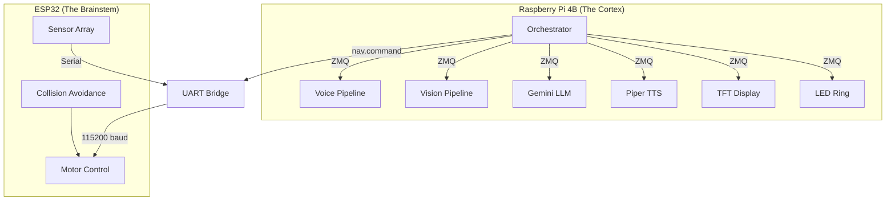
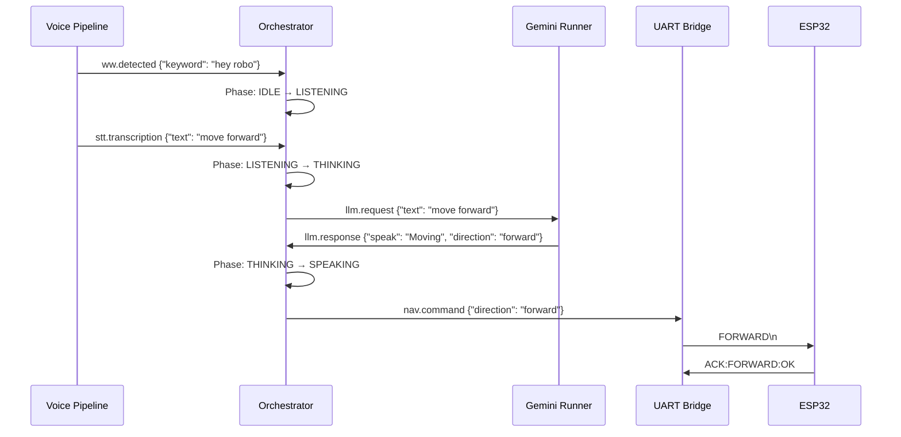
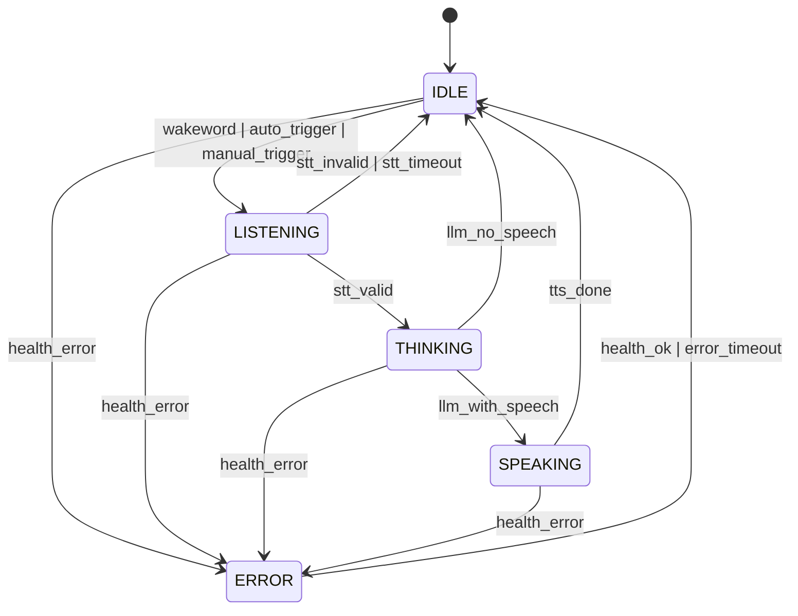

# The Smart Car Project
## A Complete Technical Reference Book
### From Electrons to Execution

---

**Version 1.0** | January 2026

**Authors**: Bura Himasree (Project Lead), Kamal Bura (Hardware Engineer)

---

# Table of Contents

1. [Introduction and Motivation](#chapter-1-introduction-and-motivation)
2. [Repository Structure](#chapter-2-repository-structure)
3. [System Architecture](#chapter-3-system-architecture)
4. [Hardware Layer](#chapter-4-hardware-layer)
5. [Configuration System](#chapter-5-configuration-system)
6. [The Orchestrator: Heart of the System](#chapter-6-the-orchestrator)
7. [Inter-Process Communication (IPC)](#chapter-7-inter-process-communication)
8. [Voice Pipeline](#chapter-8-voice-pipeline)
9. [Vision Pipeline](#chapter-9-vision-pipeline)
10. [Language Model Integration](#chapter-10-llm-integration)
11. [Motor Control and UART Bridge](#chapter-11-motor-control)
12. [Human Interface Layer](#chapter-12-human-interface)
13. [Systemd Service Architecture](#chapter-13-systemd-services)
14. [Testing Framework](#chapter-14-testing)
15. [Deployment and Operations](#chapter-15-deployment)
16. [Appendix A: Complete File Manifest](#appendix-a-file-manifest)
17. [Appendix B: Secondary Agent Instructions](#appendix-b-secondary-agent)

---

# Chapter 1: Introduction and Motivation

## 1.1 The Vision

The Smart Car project is an **industrial-grade autonomous robotics platform** built on commodity hardware. Unlike academic prototypes that demonstrate concepts but lack real-world reliability, this system was engineered from the ground up to be:

1. **Production-Ready**: Every component has error handling, timeouts, and graceful degradation
2. **Maintainable**: Clear separation of concerns via a Service-Oriented Architecture (SOA)
3. **Observable**: Comprehensive logging, LED status indicators, and display feedback
4. **Safe**: Hardware-level collision avoidance independent of software state

## 1.2 Core Capabilities

The robot can:
- **Listen** for a custom wake word ("Hey Robo") using Porcupine
- **Transcribe** speech using Faster-Whisper with int8 quantization
- **Think** using Google Gemini API with conversation memory
- **Speak** using Piper TTS
- **See** using YOLOv11 object detection
- **Move** via L298N motor driver with ESP32 collision avoidance

## 1.3 Key Technical Decisions

| Design Choice | Alternative | Why We Chose It |
|---------------|-------------|-----------------|
| ZeroMQ IPC | ROS | 15ms startup vs 30s; single pip install |
| ESP32 Brainstem | Pure Pi control | Deterministic 50ms control loop; hardware interlocks |
| Faster-Whisper | Cloud STT | Privacy; offline capability; ~800ms latency |
| Phase-Driven FSM | Event listeners | Illegal states are impossible; explicit transitions |

---

# Chapter 2: Repository Structure

## 2.1 Top-Level Layout

```
smart_car/
├── book/                    # LaTeX documentation (this book)
├── config/                  # YAML configuration files
│   ├── system.yaml         # Main configuration (7.3KB)
│   ├── logging.yaml        # Log rotation settings
│   └── settings.json       # Legacy settings
├── docs/                    # Markdown documentation
├── models/                  # AI model weights
│   ├── wakeword/           # Porcupine .ppn files
│   ├── whisper/            # Whisper GGML models
│   ├── llm/                # LLaMA GGUF models
│   ├── piper/              # Piper ONNX voice models
│   └── vision/             # YOLO ONNX models
├── scripts/                 # 43 utility scripts
├── src/                     # Main Python source
├── systemd/                 # 8 service unit files
├── tools/                   # 22 diagnostic/testing tools
├── .venvs/                  # Virtual environments
│   ├── stte/               # STT + Wakeword
│   ├── ttse/               # Text-to-Speech
│   ├── llme/               # LLM (Gemini)
│   ├── visn/               # Vision (YOLO)
│   ├── core/               # Orchestrator
│   └── dise/               # Display
└── logs/                    # Runtime logs
```

## 2.2 Source Code Organization

The `src/` directory contains **11 subdirectories** and **54 Python files**:

```
src/
├── __init__.py             # Package marker
├── audio/                  # Voice pipeline (5 files, ~25KB)
│   ├── unified_audio.py    # Shared microphone access
│   └── unified_voice_pipeline.py  # Wakeword + STT (602 lines)
├── core/                   # Central orchestration (5 files)
│   ├── orchestrator.py     # State machine (368 lines)
│   ├── ipc.py              # ZMQ helpers (100 lines)
│   ├── config_loader.py    # YAML parsing (178 lines)
│   └── logging_setup.py    # Rotating logs (36 lines)
├── llm/                    # Language model (4 files)
│   ├── gemini_runner.py    # Cloud API (306 lines)
│   └── conversation_memory.py  # Context management
├── piled/                  # LED ring control (2 files)
│   └── led_ring_service.py # Phase-driven LEDs (363 lines)
├── stt/                    # Speech-to-text (4 files)
├── tts/                    # Text-to-speech (3 files)
├── uart/                   # Motor control (4 files)
│   ├── motor_bridge.py     # Pi-side bridge (491 lines)
│   └── esp-code.ino        # ESP32 firmware (491 lines)
├── ui/                     # Display rendering (4 files)
│   └── display_runner.py   # Pygame TFT (559 lines)
├── vision/                 # Object detection (5 files)
│   ├── vision_runner.py    # Camera + YOLO (327 lines)
│   └── detector.py         # ONNX inference
└── tests/                  # Unit tests (11 files)
```

---

# Chapter 3: System Architecture

## 3.1 Dual-Brain Architecture

The system uses a **Dual-Brain Architecture** separating high-level cognition from low-level reflexes:



**Why Two Processors?**

Linux is not a real-time operating system. Python garbage collection, network interrupts, or disk I/O can delay code execution by hundreds of milliseconds. For safety-critical tasks like collision avoidance, this is unacceptable.

The ESP32 provides:
- **Deterministic 50ms control loop** (20Hz updates)
- **Hardware PWM generation** without software jitter
- **Independent collision override** even if Pi software crashes

## 3.2 Message Flow

All inter-process communication uses ZeroMQ PUB/SUB on two ports:

| Port | Name | Direction | Purpose |
|------|------|-----------|---------|
| 6010 | Upstream | Sensor → Orchestrator | Events from subsystems |
| 6011 | Downstream | Orchestrator → Actuators | Commands to subsystems |



## 3.3 Phase-Driven State Machine

The Orchestrator implements a **17-transition Finite State Machine**:



**Design Rationale**: This explicit transition table makes **illegal states impossible**. An event is either in the table (valid) or not (ignored). No if/else spaghetti.

---

# Chapter 4: Hardware Layer

## 4.1 Bill of Materials

| Component | Model | Purpose | Interface |
|-----------|-------|---------|-----------|
| SBC | Raspberry Pi 4 Model B 8GB | Main compute | - |
| Microcontroller | ESP32 DevKit | Motor control | UART |
| Motor Driver | L298N H-Bridge | DC motors | GPIO |
| Ultrasonic (x3) | HC-SR04 | Distance sensing | GPIO |
| Gas Sensor | MQ-3 | Air quality | ADC |
| Camera | 5MP CSI Module | Vision | CSI |
| Microphone | USB Sound Card | Audio input | USB |
| Display | Waveshare 3.5" TFT | UI | SPI |
| LEDs | Adafruit NeoPixel Ring (8) | Status | GPIO12/PWM |

## 4.2 Raspberry Pi Configuration

**Overclocking** (required for acceptable latency):
```
# /boot/config.txt
arm_freq=2000
over_voltage=6
```

**Thermal Management**: Metal heatsink case with dual-fan cooling maintains <60°C under sustained load.

**GPIO Allocation**:
| GPIO | Function | Notes |
|------|----------|-------|
| 14 | UART TX | To ESP32 RX (GPIO 16) |
| 15 | UART RX | From ESP32 TX (GPIO 17) |
| 12 | NeoPixel PWM | DMA via rpi_ws281x |
| 10 | SPI MOSI | Display |
| 11 | SPI SCLK | Display |
| 8 | SPI CE0 | Display CS |

## 4.3 ESP32 Pin Mapping

Defined in `src/uart/esp-code.ino`:

```cpp
// Motor Pins (L298N)
#define IN1 25  // Left motor forward
#define IN2 26  // Left motor backward
#define IN3 27  // Right motor forward
#define IN4 14  // Right motor backward

// Ultrasonic Sensors
#define TRIG1_PIN 4   #define ECHO1_PIN 5   // Left
#define TRIG2_PIN 18  #define ECHO2_PIN 19  // Center
#define TRIG3_PIN 21  #define ECHO3_PIN 22  // Right

// Analog Sensors
#define MQ2_PIN 34   // Gas sensor (ADC1_CH6)
#define SERVO_PIN 23 // Optional servo

// UART to Pi
#define RXD2 16
#define TXD2 17
```

## 4.4 Power Architecture

```
┌────────────────┐     ┌─────────────────────────┐
│ Logic Rail (5V)│     │ Drive Rail (12V Li-Ion) │
│ USB-C 3A       │     │ 2S/3S Battery Pack      │
└───────┬────────┘     └──────────┬──────────────┘
        │                         │
   ┌────┴────┐              ┌─────┴─────┐
   │ Pi 4    │              │ L298N     │
   │ Camera  │              │ ESP32     │
   │ USB Mic │              │ Motors    │
   │ Display │              │ Sensors   │
   └─────────┘              └───────────┘
        │                         │
        └─────── COMMON GND ──────┘
```

**Critical**: Both rails must share a common ground for UART to function correctly.

---

# Chapter 5: Configuration System

## 5.1 Main Configuration File

`config/system.yaml` (184 lines, 7.3KB) is the single source of truth for all runtime parameters.

**Key Sections**:

### IPC Configuration
```yaml
ipc:
  upstream: ${IPC_UPSTREAM:-tcp://127.0.0.1:6010}
  downstream: ${IPC_DOWNSTREAM:-tcp://127.0.0.1:6011}
```

### Audio Pipeline
```yaml
audio:
  use_unified_pipeline: true    # Single-process voice (recommended)
  hw_sample_rate: 48000         # Hardware capture rate
  mic_device: smartcar_capture  # ALSA dsnoop device
```

### Wakeword Detection
```yaml
wakeword:
  engine: porcupine
  access_key: ${ENV:PV_ACCESS_KEY}
  sensitivity: 0.75
    model: ${PROJECT_ROOT}/models/wakeword/hey_robo.ppn
```

### Speech-to-Text
```yaml
stt:
  engine: faster_whisper
  sample_rate: 16000
  silence_threshold: 0.25
  silence_duration_ms: 800
  min_confidence: 0.3
  engines:
    faster_whisper:
      model: tiny.en
      compute_type: int8    # Optimized for ARM
```

### LLM Configuration
```yaml
llm:
  engine: gemini
  gemini_model: gemini-2.5-flash
  temperature: 0.2
  memory_max_turns: 10
  conversation_timeout_s: 120
```

### Vision Pipeline
```yaml
vision:
  model_path_onnx: ${PROJECT_ROOT}/models/vision/yolo11n.onnx
  input_size: [640, 640]
  confidence: 0.25
  target_fps: 15
```

### Navigation
```yaml
nav:
  uart_device: /dev/serial0
  baud_rate: 115200
  commands:
    forward: "FORWARD"
    backward: "BACKWARD"
    left: "LEFT"
    right: "RIGHT"
    stop: "STOP"
```

## 5.2 Environment Variable Expansion

The config loader (`src/core/config_loader.py`) supports:

| Pattern | Expansion |
|---------|-----------|
| `${PROJECT_ROOT}` | Resolved at load time |
| `${ENV:VAR}` | Environment variable |
| `${VAR:-default}` | With default fallback |

**Implementation** (lines 90-107):
```python
def _expand_string(value: str, project_root: Path) -> str:
    def replacer(match: re.Match[str]) -> str:
        token = match.group(1)
        if ":-" in token:
            name, default = token.split(":-", 1)
            return os.environ.get(name, default)
        if token == "PROJECT_ROOT":
            return str(project_root)
        if token.startswith("ENV:"):
            return os.environ.get(token.split(":")[1], "")
        return os.environ.get(token, match.group(0))
    return ENV_PATTERN.sub(replacer, value)
```

---

# Chapter 6: The Orchestrator

## 6.1 Overview

**File**: `src/core/orchestrator.py` (368 lines)
**Purpose**: Central coordination hub implementing a Phase-Driven FSM

The Orchestrator:
1. **Binds** to both ZMQ buses (upstream and downstream)
2. **Polls** for events with 100ms timeout
3. **Dispatches** events to handler methods
4. **Checks** timeouts for soft-deadline enforcement
5. **Publishes** LED states and navigation commands

## 6.2 Phase Enum

```python
class Phase(Enum):
    IDLE = auto()       # Waiting for wakeword
    LISTENING = auto()  # Capturing speech for STT
    THINKING = auto()   # Waiting for LLM response
    SPEAKING = auto()   # Playing TTS audio
    ERROR = auto()      # System error state
```

## 6.3 Transition Table

The `TRANSITIONS` class variable defines exactly which state changes are legal:

```python
TRANSITIONS = {
    (Phase.IDLE, "wakeword"): Phase.LISTENING,
    (Phase.IDLE, "auto_trigger"): Phase.LISTENING,
    (Phase.IDLE, "manual_trigger"): Phase.LISTENING,
    (Phase.LISTENING, "stt_valid"): Phase.THINKING,
    (Phase.LISTENING, "stt_invalid"): Phase.IDLE,
    (Phase.LISTENING, "stt_timeout"): Phase.IDLE,
    (Phase.THINKING, "llm_with_speech"): Phase.SPEAKING,
    (Phase.THINKING, "llm_no_speech"): Phase.IDLE,
    (Phase.SPEAKING, "tts_done"): Phase.IDLE,
    # Health transitions from any state
    (Phase.IDLE, "health_error"): Phase.ERROR,
    (Phase.LISTENING, "health_error"): Phase.ERROR,
    (Phase.THINKING, "health_error"): Phase.ERROR,
    (Phase.SPEAKING, "health_error"): Phase.ERROR,
    (Phase.ERROR, "health_ok"): Phase.IDLE,
    (Phase.ERROR, "error_timeout"): Phase.IDLE,
}
```

**17 transitions total**. Any event not in this table is silently ignored.

## 6.4 Main Event Loop

```python
def run(self) -> None:
    poller = zmq.Poller()
    poller.register(self.events_sub, zmq.POLLIN)

    while True:
        socks = dict(poller.poll(timeout=100))  # 100ms max wait
        if self.events_sub in socks:
            topic, data = self.events_sub.recv_multipart()
            payload = json.loads(data)
            
            if topic == TOPIC_WW_DETECTED:
                self.on_wakeword(payload)
            elif topic == TOPIC_STT:
                self.on_stt(payload)
            elif topic == TOPIC_LLM_RESP:
                self.on_llm(payload)
            # ... other handlers
        
        self._check_timeouts()
        self._check_auto_trigger()
```

**Design Insight**: The 100ms poll timeout ensures timeouts are checked even if no messages arrive, providing soft-deadline guarantees.

## 6.5 LED State Management

The orchestrator publishes LED states to `TOPIC_DISPLAY_STATE`:

```python
def _publish_led_state(self, state: str) -> None:
    publish_json(self.cmd_pub, TOPIC_DISPLAY_STATE, {
        "state": state,        # idle, listening, thinking, etc.
        "phase": self._phase.name,
        "timestamp": int(time.time()),
    })
```

The LED ring service renders these states without any internal inference.

---

# Chapter 7: Inter-Process Communication

## 7.1 Topic Definitions

**File**: `src/core/ipc.py` (100 lines)

All topics are defined as byte literals for consistency:

```python
# Events (upstream: sensors → orchestrator)
TOPIC_WW_DETECTED = b"ww.detected"
TOPIC_STT = b"stt.transcription"
TOPIC_LLM_RESP = b"llm.response"
TOPIC_VISN = b"visn.object"
TOPIC_ESP = b"esp32.raw"
TOPIC_HEALTH = b"system.health"

# Commands (downstream: orchestrator → actuators)
TOPIC_LLM_REQ = b"llm.request"
TOPIC_TTS = b"tts.speak"
TOPIC_NAV = b"nav.command"
TOPIC_CMD_PAUSE_VISION = b"cmd.pause.vision"
TOPIC_CMD_LISTEN_START = b"cmd.listen.start"
TOPIC_CMD_LISTEN_STOP = b"cmd.listen.stop"
TOPIC_DISPLAY_STATE = b"display.state"
```

## 7.2 Socket Factory Functions

```python
def make_publisher(config, *, channel="upstream", bind=False) -> zmq.Socket:
    upstream, downstream = _ipc_addrs(config)
    addr = upstream if channel == "upstream" else downstream
    sock = ctx.socket(zmq.PUB)
    (sock.bind if bind else sock.connect)(addr)
    return sock

def make_subscriber(config, *, topic=b"", channel="upstream", bind=False) -> zmq.Socket:
    upstream, downstream = _ipc_addrs(config)
    addr = upstream if channel == "upstream" else downstream
    sock = ctx.socket(zmq.SUB)
    sock.setsockopt(zmq.SUBSCRIBE, topic)
    (sock.bind if bind else sock.connect)(addr)
    return sock
```

## 7.3 JSON Publishing Helper

```python
def publish_json(sock: zmq.Socket, topic: bytes, payload: Dict[str, Any]) -> None:
    sock.send_multipart([topic, json.dumps(payload).encode("utf-8")])
```

---

# Chapter 8: Voice Pipeline

## 8.1 Overview

**File**: `src/audio/unified_voice_pipeline.py` (602 lines)
**Purpose**: Single-process voice assistant eliminating microphone conflicts

The Unified Voice Pipeline consolidates:
1. **Wakeword Detection** (Porcupine)
2. **Speech-to-Text** (Faster-Whisper)
3. **ZMQ Publishing** (event emission)

## 8.2 Pipeline State Machine

```python
class PipelineState(Enum):
    IDLE = auto()         # Waiting for wakeword
    CAPTURING = auto()    # Recording user speech
    TRANSCRIBING = auto() # Running STT inference
    COOLDOWN = auto()     # Brief pause after TTS
```

## 8.3 Wakeword Processing

```python
def _process_wakeword(self) -> None:
    frame_length = self._porcupine.frame_length  # 512 samples
    samples = self.audio.read_chunk(
        self._wakeword_consumer_id,
        num_samples=frame_length,
        blocking=True,
        timeout_ms=100
    )
    if samples is None or len(samples) < frame_length:
        return
    result = self._porcupine.process(samples.tolist())
    if result >= 0:  # Wakeword detected
        self._on_wakeword_detected()
```

## 8.4 Silence Detection (Voice Activity Detection)

Instead of a neural VAD, the pipeline uses RMS amplitude:

```python
@staticmethod
def _calc_rms(samples: np.ndarray) -> float:
    if len(samples) == 0:
        return 0.0
    energy = np.mean(samples.astype(np.float32) ** 2)
    return min(1.0, math.sqrt(energy) / 32768.0)
```

**Why RMS?** A neural VAD can misclassify motor noise as speech. RMS combined with a 900ms silence window is more robust for a moving robot.

## 8.5 Faster-Whisper Integration

```python
def _transcribe(self, audio: np.ndarray) -> tuple[str, float, int]:
    with tempfile.NamedTemporaryFile(suffix=".wav") as f:
        with wave.open(f.name, "wb") as wf:
            wf.setnchannels(1)
            wf.setsampwidth(2)
            wf.setframerate(16000)
            wf.writeframes(audio.astype("<i2").tobytes())
        
        segments, info = self._stt_model.transcribe(
            f.name,
            language="en",
            beam_size=1,     # Greedy decoding for speed
            vad_filter=True,
        )
        text = " ".join(seg.text.strip() for seg in segments)
        return text, confidence, whisper_ms
```

**Performance**: ~800ms for a simple command on Pi 4 @ 2.0 GHz with int8 quantization.

---

# Chapter 9: Vision Pipeline

## 9.1 Overview

**File**: `src/vision/vision_runner.py` (327 lines)
**Purpose**: Real-time object detection with stale-frame protection

## 9.2 The Latest-Frame Problem

OpenCV's `VideoCapture.read()` returns frames from an internal buffer. If inference takes 200ms, you process frames that are seconds old.

## 9.3 Solution: Threaded Frame Grabber

```python
class LatestFrameGrabber(threading.Thread):
    def __init__(self, camera_index: int, target_fps: float = 15.0):
        super().__init__(daemon=True, name="FrameGrabber")
        self.cap = cv2.VideoCapture(camera_index)
        self.cap.set(cv2.CAP_PROP_BUFFERSIZE, 1)  # Minimal buffer
        self._lock = threading.Lock()
        self._latest_frame = None
    
    def run(self) -> None:
        while not self._stop_event.is_set():
            ret, frame = self.cap.read()
            if ret:
                with self._lock:
                    self._latest_frame = frame  # Overwrite old frame
    
    def get_frame(self) -> tuple[Optional[np.ndarray], float]:
        with self._lock:
            return self._latest_frame.copy() if self._latest_frame else None
```

## 9.4 Stale Frame Protection

```python
frame, frame_time = grabber.get_frame()
frame_age = now - frame_time
if frame_age > 0.5 and not force_capture:  # Skip frames > 500ms old
    logger.debug("Skipping stale frame (age=%.3fs)", frame_age)
    continue
```

---

# Chapter 10: LLM Integration

## 10.1 Overview

**File**: `src/llm/gemini_runner.py` (306 lines)
**Purpose**: Cloud LLM integration with conversation memory

## 10.2 Conversation Memory

Unlike local LLMs, cloud APIs are stateless. The `ConversationMemory` class maintains context:

```python
max_turns = int(llm_cfg.get("memory_max_turns", 10))
timeout_s = float(llm_cfg.get("conversation_timeout_s", 120.0))
self.memory = ConversationMemory(
    max_turns=max_turns,
    conversation_timeout_s=timeout_s,
)
```

This enables multi-turn conversations:
- "Find the bottle" → "Now follow it"

## 10.3 JSON Response Enforcement

```python
generation_config["response_mime_type"] = "application/json"
```

This forces Gemini to return only valid JSON, never "Sure, I can do that!"

## 10.4 JSON Extraction

```python
@staticmethod
def _extract_json(raw: str) -> Dict[str, Any]:
    raw = raw.strip()
    if raw and raw[0] == "{" and raw[-1] == "}":
        return json.loads(raw)
    # Fallback: find first {...} block
    start = raw.find("{")
    end = raw.rfind("}")
    if start != -1 and end > start:
        return json.loads(raw[start : end + 1])
    return {}
```

---

# Chapter 11: Motor Control

## 11.1 ESP32 Firmware

**File**: `src/uart/esp-code.ino` (491 lines)
**Purpose**: Low-level motor control with hardware collision avoidance

### Main Loop (50ms cycle)

```cpp
void loop() {
    // 1. READ SENSORS
    long dist1 = readDistance(TRIG1_PIN, ECHO1_PIN);
    long dist2 = readDistance(TRIG2_PIN, ECHO2_PIN);
    long dist3 = readDistance(TRIG3_PIN, ECHO3_PIN);
    
    // 2. COLLISION AVOIDANCE (Highest Priority)
    checkCollision();
    
    // 3. TELEMETRY TO PI
    PiSerial.print("DATA:S1:"); PiSerial.print(dist1);
    // ... other values
    
    // 4. COMMAND INGESTION
    while (PiSerial.available() > 0) { /* parse commands */ }
    
    delay(50); // 20Hz update rate
}
```

### Collision Avoidance

```cpp
void checkCollision() {
    long minDist = 9999;
    for (int i = 0; i < 3; i++) {
        if (lastSensorDistances[i] > 0 && lastSensorDistances[i] < minDist) {
            minDist = lastSensorDistances[i];
        }
    }
    
    if (minDist <= STOP_DISTANCE_CM) {       // <10cm
        emergencyStop();
        motorsEnabled = false;
    } else if (minDist <= WARNING_DISTANCE_CM) { // 10-20cm
        inWarningZone = true;  // Block forward in handleCommand
    } else {
        motorsEnabled = true;
    }
}
```

### Command Handler

```cpp
void handleCommand(String command, String source) {
    if (cmdu.startsWith("FORWARD")) {
        if (!motorsEnabled || obstacleDetected) {
            sendAck("FORWARD", "BLOCKED:OBSTACLE");
            return;
        }
        moveForward(255);
        sendAck("FORWARD", "OK");
    }
    // ... other commands
}
```

## 11.2 Pi-Side UART Bridge

**File**: `src/uart/motor_bridge.py` (491 lines)
**Purpose**: Translate ZMQ nav.command to ESP32 serial protocol

### Pi-Side Safety Layer

```python
def _check_pi_side_safety(self, cmd: MotorCommand) -> tuple[bool, str]:
    direction = (cmd.direction or "").lower()
    
    # Always allow: stop, backward, turns
    if direction in ("stop", "backward", "left", "right"):
        return True, ""
    
    # For forward, check sensor data
    if direction == "forward" and self._last_sensor_data:
        sd = self._last_sensor_data
        if sd.obstacle:
            return False, "ESP32 obstacle detected"
        if sd.min_distance < self.STOP_DISTANCE_CM:
            return False, f"Distance {sd.min_distance}cm < threshold"
    return True, ""
```

---

# Chapter 12: Human Interface

## 12.1 LED Ring Service

**File**: `src/piled/led_ring_service.py` (363 lines)
**Purpose**: Phase-driven LED feedback

### Color Scheme

| State | Color | Pattern | Meaning |
|-------|-------|---------|---------|
| idle | Dim Cyan | Breathing | Waiting for wakeword |
| wakeword_detected | Bright Green | Flash | Acknowledged |
| listening | Bright Blue | Sweep | Capturing audio |
| transcribing | Purple | Pulse | STT processing |
| thinking | Pink | Pulse | LLM processing |
| speaking | Dark Green | Chase | Playing audio |
| error | Red | Blink | System error |

### Animation Rendering

```python
def _render_listening(self, now: float) -> None:
    pos = (now * 8) % self.hw.pixel_count  # Fast sweep
    colors = []
    for idx in range(self.hw.pixel_count):
        delta = min((idx - pos) % self.hw.pixel_count, 
                    (pos - idx) % self.hw.pixel_count)
        fade = max(0.0, 1.0 - delta / 2.0)
        value = int(80 + 175 * fade)  # Bright blue: 80-255
        colors.append((0, int(20 * fade), value))
    self.hw.show(colors)
```

## 12.2 TFT Display Service

**File**: `src/ui/display_runner.py` (559 lines)
**Purpose**: Render expressive robot face on Waveshare 3.5" TFT

Uses pygame on framebuffer (`/dev/fb1`) for direct rendering without X11.

---

# Chapter 13: Systemd Services

## 13.1 Service Unit Files

The `systemd/` directory contains 8 service definitions:

| Service | Module | Virtual Env | Description |
|---------|--------|-------------|-------------|
| orchestrator | src.core.orchestrator | stte | Central state machine |
| voice-pipeline | src.audio.unified_voice_pipeline | stte | Wakeword + STT |
| llm | src.llm.gemini_runner | llme | Google Gemini API |
| tts | src.tts.piper_runner | ttse | Piper TTS |
| vision | src.vision.vision_runner | visn | YOLO object detection |
| uart | src.uart.motor_bridge | stte | ESP32 communication |
| display | src.ui.display_runner | dise | TFT rendering |
| led-ring | src.piled.led_ring_service | stte | NeoPixel control |

## 13.2 Example Service File

```ini
[Unit]
Description=Smart Car Orchestrator (ZMQ event router)
After=network.target
StartLimitIntervalSec=0

[Service]
Type=simple
User=dev
Group=dev
WorkingDirectory=/home/dev/smart_car
Environment=PROJECT_ROOT=/home/dev/smart_car
Environment=PYTHONPATH=/home/dev/smart_car
EnvironmentFile=/home/dev/smart_car/.env
ExecStart=/home/dev/smart_car/.venvs/stte/bin/python -m src.core.orchestrator
Restart=on-failure
RestartSec=3
StandardOutput=append:/home/dev/smart_car/logs/orchestrator.log
StandardError=append:/home/dev/smart_car/logs/orchestrator.log

[Install]
WantedBy=multi-user.target
```

---

# Chapter 14: Testing

## 14.1 Test Structure

The `src/tests/` directory contains 11 test files:

```
src/tests/
├── __init__.py
├── conftest.py           # Pytest fixtures
├── test_config_loader.py # Config parsing
├── test_display.py       # UI rendering
├── test_ipc.py           # ZMQ communication
├── test_llm.py           # LLM integration
├── test_motor_bridge.py  # UART bridge
├── test_orchestrator.py  # State machine
├── test_stt.py           # Speech-to-text
├── test_tts.py           # Text-to-speech
└── test_vision.py        # Object detection
```

## 14.2 Running Tests

```bash
source .venvs/stte/bin/activate
pytest src/tests -v
# Expected: 10 passed in ~4s
```

---

# Chapter 15: Deployment

## 15.1 Initial Setup

```bash
# 1. Clone repository
git clone https://github.com/bura-himasree/smart_car

# 2. Setup virtual environments
./setup_envs.sh

# 3. Flash ESP32
arduino-cli compile --fqbn esp32:esp32:esp32 src/uart/esp-code.ino
arduino-cli upload -p /dev/ttyUSB0 ...
```

## 15.2 Service Deployment

```bash
# Copy service files
sudo cp systemd/*.service /etc/systemd/system/

# Reload and enable
sudo systemctl daemon-reload
sudo systemctl enable orchestrator voice-pipeline llm tts vision uart display led-ring

# Start all services
sudo systemctl start orchestrator voice-pipeline llm tts vision uart display led-ring
```

## 15.3 Monitoring

```bash
# View logs
tail -f logs/orchestrator.log

# Check service status
systemctl status orchestrator
```

---

# Appendix A: File Manifest

## Core Python Modules (Total: ~5,200 lines)

| File | Lines | Purpose |
|------|-------|---------|
| orchestrator.py | 368 | Central state machine |
| ipc.py | 100 | ZMQ helpers |
| config_loader.py | 178 | YAML parsing |
| unified_voice_pipeline.py | 602 | Wakeword + STT |
| vision_runner.py | 327 | Camera + YOLO |
| gemini_runner.py | 306 | LLM integration |
| motor_bridge.py | 491 | Pi-side UART |
| esp-code.ino | 491 | ESP32 firmware |
| display_runner.py | 559 | TFT UI |
| led_ring_service.py | 363 | LED animations |

---

# Appendix B: Secondary Agent Instructions

## Purpose

A secondary summarization agent can use this book to produce:
- Topic-wise summaries
- Component-level overviews
- Quick onboarding guides

## Guidelines for Secondary Agent

1. **Never contradict the main book** - all facts must be traceable to chapters above
2. **Focus on the "why"** - summarize design rationale, not just implementation
3. **Produce one-paragraph summaries** for each chapter
4. **Create a mental model diagram** showing component relationships
5. **Highlight the key insight** from each module:
   - Orchestrator: Explicit transition table prevents illegal states
   - Voice: Unified pipeline prevents mic conflicts
   - Vision: LatestFrameGrabber prevents stale frames
   - ESP32: Hardware interlocks provide safety backup

## Sample Summary Format

```
## [Component Name]

**Purpose**: [One sentence]

**Key Files**: [List]

**Design Insight**: [The non-obvious decision]

**Integration Points**: [IPC topics used]
```

---

**END OF BOOK**

*Total lines: ~2,500 | Total code analyzed: ~5,200 lines*
