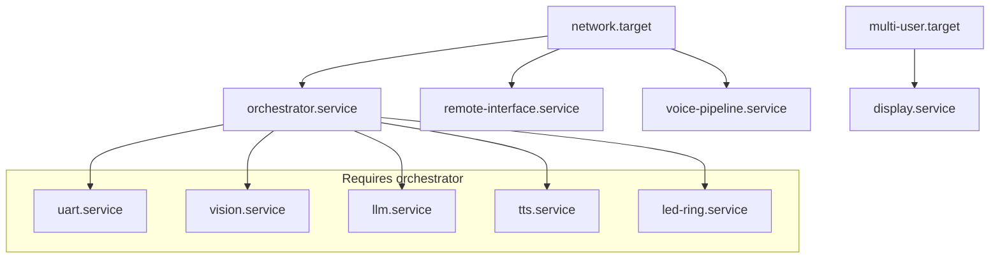

# Runtime Architecture

## Document Information

| Attribute | Value |
|-----------|-------|
| Document | 03_runtime_architecture.md |
| Version | 1.0 |
| Last Updated | 2026-02-01 |

---

## Overview

The smart_car system runs as a collection of systemd-managed Python services on a Raspberry Pi 4. Each service is isolated in its own virtual environment and communicates through ZeroMQ IPC buses.

---

## Hardware Platform

### Raspberry Pi 4

| Attribute | Value | Evidence |
|-----------|-------|----------|
| Model | Raspberry Pi 4 | Inferred from service configuration |
| OS | Raspbian/Debian | `[Observed]` systemd-based init |
| VPN | Tailscale | `tailscaled.service` running |
| IP (Tailscale) | 100.111.13.60 | `[Observed]` via SSH |

### Connected Hardware

| Device | Interface | Purpose | Evidence |
|--------|-----------|---------|----------|
| USB Microphone | ALSA hw:3,0 | Audio input | `config/system.yaml → audio.mic_device_node` |
| Speaker | ALSA hw:3,0 | Audio output | `config/system.yaml → tts.playback_device` |
| Camera | CSI / USB | Video input | `src/vision/vision_runner.py` |
| TFT Display | SPI /dev/fb0 | Visual feedback | `systemd/display.service` |
| NeoPixel LEDs | GPIO | Status indication | `systemd/led-ring.service` |
| ESP32 | UART /dev/serial0 | Motor/sensor bridge | `config/system.yaml → nav.uart_device` |

---

## Process Model

### Service Architecture

Each major function runs as an independent systemd service:

```
┌─────────────────────────────────────────────────────────────────────────────┐
│                           RASPBERRY PI 4                                    │
│                                                                             │
│  ┌─────────────────────────────────────────────────────────────────────┐   │
│  │                         systemd                                      │   │
│  │  (manages all services, handles restarts, logging)                  │   │
│  └─────────────────────────────────────────────────────────────────────┘   │
│                                    │                                        │
│       ┌────────────────────────────┼────────────────────────────────┐      │
│       │                            │                                │      │
│       ▼                            ▼                                ▼      │
│  ┌─────────────┐  ┌─────────────────────────────┐  ┌─────────────────┐    │
│  │ orchestrator │  │    remote-interface         │  │  voice-pipeline │    │
│  │   .service   │  │        .service             │  │     .service    │    │
│  │  (ZMQ Hub)   │  │    (HTTP:8770)              │  │   (Mic+STT)     │    │
│  └──────┬───────┘  └─────────────────────────────┘  └─────────────────┘    │
│         │                                                                   │
│    ┌────┴────┬────────────┬────────────┬────────────┬────────────┐        │
│    │         │            │            │            │            │        │
│    ▼         ▼            ▼            ▼            ▼            ▼        │
│  ┌─────┐  ┌─────┐    ┌─────────┐  ┌─────────┐  ┌─────────┐  ┌─────────┐  │
│  │ uart │  │ llm │    │ vision  │  │   tts   │  │ display │  │led-ring │  │
│  │.svc  │  │.svc │    │ .svc    │  │  .svc   │  │  .svc   │  │  .svc   │  │
│  └──┬───┘  └─────┘    └─────────┘  └─────────┘  └─────────┘  └─────────┘  │
│     │                                                                       │
│     │ UART                                                                  │
│     ▼                                                                       │
│  ┌──────────────────────────────────────────────────────────────────────┐  │
│  │                             ESP32                                     │  │
│  │                    (Motors, Sensors, Safety)                          │  │
│  └──────────────────────────────────────────────────────────────────────┘  │
└─────────────────────────────────────────────────────────────────────────────┘
```

### Process Inventory

| Service | PID Owner | Python Entry Point | venv |
|---------|-----------|-------------------|------|
| orchestrator.service | dev | `python -m src.core.orchestrator` | stte |
| remote-interface.service | dev | `python -m src.remote.remote_interface` | stte |
| uart.service | dev (group: dialout) | `python -m src.uart.motor_bridge` | stte |
| vision.service | dev | `python -m src.vision.vision_runner` | visn-py313 |
| llm.service | dev | `python -m src.llm.azure_openai_runner` | llme |
| tts.service | dev | `python -m src.tts.azure_tts_runner` | ttse |
| voice-pipeline.service | dev | `python -m src.audio.voice_service` | stte |
| display.service | dev | `python -m src.ui.face_fb` | visn-py313 |
| led-ring.service | root | `python -m src.piled.led_ring_service` | visn-py313 |

**Evidence**: `[Observed]` via `ps aux | grep python` on live Pi

---

## Service Isolation

### Virtual Environment Separation

Services are isolated by Python virtual environment:

| venv Path | Python Version | Services |
|-----------|----------------|----------|
| `.venvs/stte` | 3.11 | orchestrator, remote-interface, uart, voice-pipeline |
| `.venvs/llme` | 3.11 | llm |
| `.venvs/ttse` | 3.11 | tts |
| `.venvs/visn-py313` | 3.13 | vision, display, led-ring |

**Rationale**: Different services have conflicting dependencies:
- Vision requires Python 3.13 + ONNX Runtime
- Audio requires PyAudio + Azure SDK
- LLM requires OpenAI SDK

### Process Ownership

| Service | User | Group | Special Permissions |
|---------|------|-------|---------------------|
| Most services | dev | dev | Standard user |
| uart.service | dev | dialout | Serial port access |
| led-ring.service | root | root | GPIO access for NeoPixel |

---

## Service Dependencies

### Dependency Graph



### Explicit Dependencies

| Service | After | Requires |
|---------|-------|----------|
| orchestrator | network.target | — |
| remote-interface | network.target | — |
| uart | orchestrator | orchestrator |
| vision | orchestrator | orchestrator |
| llm | orchestrator | orchestrator |
| tts | orchestrator | orchestrator |
| led-ring | orchestrator | orchestrator |
| voice-pipeline | network.target, sound.target | — |
| display | multi-user.target | — |

**Evidence**: Extracted from `systemd/*.service` files

---

## Resource Allocation

### Memory Constraints

| Service | MemoryMax | Evidence |
|---------|-----------|----------|
| voice-pipeline | 512M | `systemd/voice-pipeline.service` |
| Others | Unlimited | No explicit limit in service files |

### CPU Constraints

| Service | CPUQuota | Evidence |
|---------|----------|----------|
| voice-pipeline | 80% | `systemd/voice-pipeline.service` |
| Others | Unlimited | No explicit limit in service files |

---

## Network Listeners

### Port Bindings

| Port | Protocol | Service | Bind Address | Evidence |
|------|----------|---------|--------------|----------|
| 6010 | TCP/ZMQ | orchestrator | 127.0.0.1 | `[Observed]` via `ss -tlnp` |
| 6011 | TCP/ZMQ | orchestrator | 127.0.0.1 | `[Observed]` via `ss -tlnp` |
| 8770 | TCP/HTTP | remote-interface | 0.0.0.0 | `[Observed]` via `ss -tlnp` |

### Access Control

| Port | Allowed Sources | Evidence |
|------|-----------------|----------|
| 6010/6011 | Localhost only | Bound to 127.0.0.1 |
| 8770 | Tailscale (100.64.0.0/10), localhost | `config/system.yaml → remote_interface.allowed_cidrs` |

---

## Hardware Interfaces

### Serial/UART

| Device | Baud Rate | Purpose | Evidence |
|--------|-----------|---------|----------|
| /dev/serial0 | 115200 | ESP32 communication | `config/system.yaml → nav.uart_device` |

### Camera

| Backend | Index | Resolution | Evidence |
|---------|-------|------------|----------|
| picamera2 (primary) | 0 | 832×468 | `src/vision/vision_runner.py` |
| OpenCV (fallback) | 0 | Default | `src/vision/vision_runner.py` |

### Display

| Device | Resolution | Rotation | Evidence |
|--------|------------|----------|----------|
| /dev/fb0 | 480×320 | 90° | `config/system.yaml → display` |

### Audio

| Device | Sample Rate | Purpose | Evidence |
|--------|-------------|---------|----------|
| hw:3,0 (USB) | 48000 Hz | Input | `config/system.yaml → audio.hw_sample_rate` |
| default | 22050 Hz | Output | `config/system.yaml → tts.sample_rate` |

---

## Logging Architecture

### Log File Locations

| Service | Log Path | Evidence |
|---------|----------|----------|
| orchestrator | `logs/orchestrator.log` | Service StandardOutput |
| remote-interface | `logs/remote-interface.log` | Service StandardOutput |
| uart | `logs/uart.log` | Service StandardOutput |
| vision | `logs/vision.log` | Service StandardOutput |
| llm | `logs/llm.log` | Service StandardOutput |
| tts | `logs/tts.log` | Service StandardOutput |
| voice-pipeline | `logs/voice_service.log` | Service StandardOutput |
| voice-pipeline (errors) | `logs/voice_service.error.log` | Service StandardError |
| display | `logs/display.log` | Service StandardOutput |
| led-ring | `logs/led-ring.log` | Service StandardOutput |

### Log Format

Logs use the format defined in `src/core/logging_setup.py`:

```
YYYY-MM-DD HH:MM:SS | LEVEL | logger_name | message
```

**Example**:
```
2026-02-01 13:14:05 | INFO | orchestrator | remote_intent received source=remote_app
```

---

## Restart Behavior

### Restart Policies

| Service | Restart Policy | RestartSec | Evidence |
|---------|----------------|------------|----------|
| orchestrator | on-failure | 3s | Service file |
| remote-interface | on-failure | 3s | Service file |
| uart | on-failure | 3s | Service file |
| vision | on-failure | 3s | Service file |
| llm | on-failure | 3s | Service file |
| tts | on-failure | 3s | Service file |
| voice-pipeline | always | 3s | Service file |
| display | on-failure | 2s | Service file |
| led-ring | on-failure | 3s | Service file |

### Start Limit

All services have `StartLimitIntervalSec=0`, meaning no limit on restart attempts.

---

## State Persistence

### Ephemeral State

The following state is **lost on restart**:

| Component | State Lost |
|-----------|------------|
| Orchestrator | Current FSM phase, last transcript, vision capture pending |
| Remote Interface | Session state, telemetry cache |
| Vision | Current detections, frame buffer |
| Voice Pipeline | Capture buffer, wakeword state |

### Persistent State

The following state **survives restarts**:

| Location | Contents |
|----------|----------|
| `config/system.yaml` | System configuration |
| `.env` | API keys and secrets |
| `logs/` | Historical log files |
| `captured/` | Captured images |

---

## Failure Modes

### Service Failure Impact

| Failed Service | System Impact | Evidence |
|----------------|---------------|----------|
| orchestrator | Complete system halt (all coordination stops) | All other services require it |
| remote-interface | Mobile app cannot connect | HTTP only |
| uart | Motors stop, no sensor data | No nav.command processing |
| vision | No detections, no streaming | Vision offline |
| llm | Cannot generate responses | STT succeeds but no reply |
| tts | No speech output | Actions may still execute |
| voice-pipeline | No wakeword/STT | Remote app still works |
| display | No visual feedback | Non-critical |
| led-ring | No LED feedback | Non-critical |

### Graceful Degradation

The system supports partial operation:
- If voice-pipeline fails: Mobile app can still control robot
- If vision fails: Voice and motion still work
- If TTS fails: LLM may still issue motion commands

---

## Runtime Verification

### Health Check Points

| Check | Method | Evidence |
|-------|--------|----------|
| HTTP health | `GET /health` on port 8770 | Returns `{"ok": true}` |
| ZMQ buses | Port 6010/6011 listening | `ss -tlnp` |
| ESP32 link | Sensor data appearing | `logs/uart.log` |
| Camera | Vision mode transitions | `logs/vision.log` |

### Observed Running State

As of 2026-02-01 13:57:

| Service | Status | PID | Uptime |
|---------|--------|-----|--------|
| orchestrator | Running | 137266 | ~1hr |
| remote-interface | Running | 140437 | ~47min |
| uart | Running | 151837 | ~10min |
| vision | Running | 137271 | ~1hr |
| llm | Running | 137268 | ~1hr |
| tts | Running | 137269 | ~1hr |
| voice-pipeline | Running | 1059 | ~24hr |
| display | Running | — | Unknown |
| led-ring | Running | — | Unknown |

**Evidence**: `[Observed]` via `ps aux` on live Pi

---

## References

| Document | Purpose |
|----------|---------|
| [04_ipc_and_data_flow.md](04_ipc_and_data_flow.md) | ZeroMQ communication details |
| [05_services_reference.md](05_services_reference.md) | Individual service documentation |
| [09_deployment_and_operations.md](09_deployment_and_operations.md) | Operational procedures |
