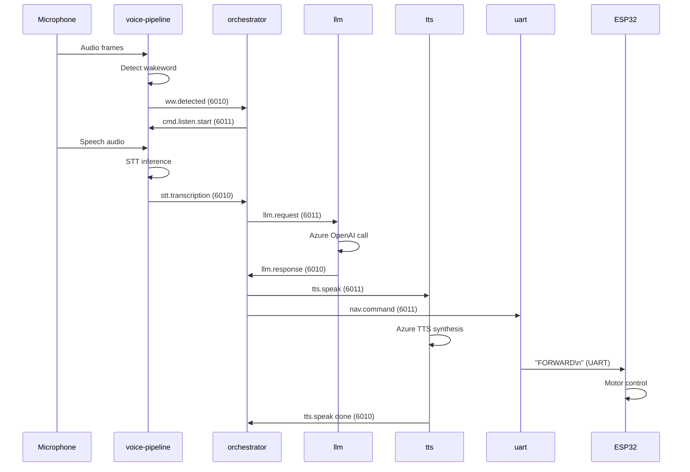
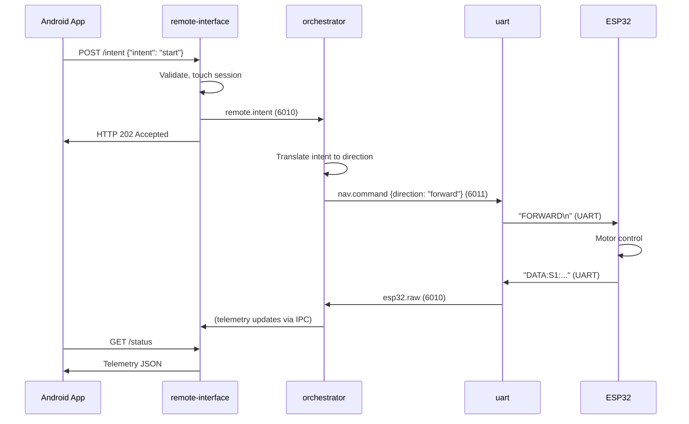

# IPC and Data Flow

## Document Information

| Attribute | Value |
|-----------|-------|
| Document | 04_ipc_and_data_flow.md |
| Version | 1.0 |
| Last Updated | 2026-02-01 |

---

## Overview

The smart_car system uses a dual-bus ZeroMQ PUB/SUB architecture for inter-process communication. All Python services communicate through two TCP buses, while the mobile app uses HTTP and the ESP32 uses UART.

---

## Communication Layers

| Layer | Protocol | Purpose |
|-------|----------|---------|
| Internal IPC | ZeroMQ PUB/SUB | Service-to-service communication |
| External API | HTTP/REST | Mobile app supervision |
| Hardware | UART (serial) | ESP32 motor/sensor bridge |
| Streaming | MJPEG over HTTP | Live video feed |

---

## ZeroMQ Bus Architecture

### Dual Bus Model

The system uses two unidirectional buses:

| Bus | Port | Direction | Binding |
|-----|------|-----------|---------|
| Upstream | 6010 | Modules → Orchestrator | Orchestrator binds |
| Downstream | 6011 | Orchestrator → Modules | Orchestrator binds |

**Evidence**: `src/core/ipc.py`, `config/system.yaml → ipc`

### Bus Configuration

```yaml
# config/system.yaml
ipc:
  upstream: tcp://127.0.0.1:6010    # module → orchestrator
  downstream: tcp://127.0.0.1:6011  # orchestrator → modules
```

### Connection Pattern

```
┌─────────────────────────────────────────────────────────────────────────────┐
│                              ORCHESTRATOR                                   │
│                                                                             │
│   ┌─────────────────────┐         ┌─────────────────────┐                  │
│   │  SUB (bind: 6010)   │         │  PUB (bind: 6011)   │                  │
│   │    UPSTREAM         │         │    DOWNSTREAM       │                  │
│   └─────────┬───────────┘         └──────────┬──────────┘                  │
└─────────────┼────────────────────────────────┼──────────────────────────────┘
              │                                │
              │ connect                        │ connect
              │                                │
    ┌─────────┴─────────┐            ┌─────────┴─────────┐
    │                   │            │                   │
    ▼                   ▼            ▼                   ▼
┌───────────┐     ┌───────────┐  ┌───────────┐     ┌───────────┐
│   voice   │     │   uart    │  │   vision  │     │    llm    │
│  pipeline │     │  bridge   │  │  runner   │     │  runner   │
│           │     │           │  │           │     │           │
│ PUB→6010  │     │ PUB→6010  │  │ SUB←6011  │     │ SUB←6011  │
│ SUB←6011  │     │ SUB←6011  │  │ PUB→6010  │     │ PUB→6010  │
└───────────┘     └───────────┘  └───────────┘     └───────────┘
```

---

## Topic Taxonomy

### Topic Naming Convention

Topics are prefixed bytes that identify message types:

| Prefix | Category | Direction |
|--------|----------|-----------|
| `ww.*` | Wakeword | Upstream |
| `stt.*` | Speech-to-text | Upstream |
| `llm.*` | Language model | Both |
| `tts.*` | Text-to-speech | Both |
| `visn.*` | Vision | Both |
| `nav.*` | Navigation | Downstream |
| `esp32.*` | ESP32 sensor data | Upstream |
| `cmd.*` | Commands | Downstream |
| `remote.*` | Remote supervision | Upstream |
| `display.*` | Display state | Downstream |
| `system.*` | System health | Upstream |

### Complete Topic List

**Source**: `src/core/ipc.py`

#### Upstream Topics (Module → Orchestrator)

| Topic | Type | Publisher | Description |
|-------|------|-----------|-------------|
| `ww.detected` | Event | voice-pipeline | Wakeword triggered |
| `stt.transcription` | Event | voice-pipeline | STT result with text and confidence |
| `llm.response` | Event | llm | LLM response with speech and direction |
| `visn.object` | Event | vision | Object detection result |
| `visn.frame` | Binary | vision | JPEG frame for streaming |
| `visn.capture` | Event | vision | Captured frame notification |
| `esp32.raw` | Event | uart | Sensor data from ESP32 |
| `system.health` | Event | various | Health status updates |
| `remote.intent` | Event | remote-interface | Intent from mobile app |
| `remote.session` | Event | remote-interface | Session state changes |
| `remote.event` | Event | orchestrator | Remote event notifications |

#### Downstream Topics (Orchestrator → Modules)

| Topic | Type | Subscriber | Description |
|-------|------|------------|-------------|
| `llm.request` | Command | llm | Request LLM inference |
| `tts.speak` | Command | tts | Request speech synthesis |
| `nav.command` | Command | uart | Motor direction command |
| `cmd.listen.start` | Command | voice-pipeline | Start listening for speech |
| `cmd.listen.stop` | Command | voice-pipeline | Stop listening |
| `cmd.pause.vision` | Command | vision | Pause/resume inference |
| `cmd.vision.mode` | Command | vision | Set vision mode |
| `cmd.visn.capture` | Command | vision | Capture single frame |
| `display.state` | Event | display, led-ring | Current phase for visualization |
| `display.text` | Event | display | Text to show on display |

---

## Topic Payload Schemas

### ww.detected

```json
{
  "keyword": "hey robo",
  "timestamp": 1769931845,
  "source": "voice_pipeline"
}
```

### stt.transcription

```json
{
  "text": "move forward please",
  "confidence": 0.95,
  "language": "en",
  "timestamp": 1769931850,
  "source": "voice_pipeline"
}
```

### llm.request

```json
{
  "text": "move forward please",
  "direction": "stopped",
  "world_context": { ... },
  "context_note": "system_observation_only_last_known_state",
  "source": "orchestrator"
}
```

### llm.response

```json
{
  "json": {
    "speak": "Moving forward now",
    "direction": "forward"
  },
  "text": "Moving forward now",
  "raw": "...",
  "source": "llm"
}
```

### tts.speak

```json
{
  "text": "Moving forward now",
  "source": "orchestrator"
}
```

**Completion notification**:
```json
{
  "done": true,
  "source": "tts"
}
```

### nav.command

```json
{
  "direction": "forward",
  "speed": null,
  "duration_ms": null,
  "source": "orchestrator"
}
```

### esp32.raw

```json
{
  "data": {
    "s1": 16,
    "s2": 12,
    "s3": -1,
    "mq2": 478,
    "lmotor": -255,
    "rmotor": -255,
    "min_distance": 12,
    "obstacle": false,
    "warning": false,
    "is_safe": false
  },
  "data_ts": 1769935097,
  "buffer": [ ... ]
}
```

### visn.object

```json
{
  "label": "person",
  "confidence": 0.87,
  "bbox": [100, 50, 200, 300],
  "ts": 1769931845.123,
  "request_id": "visn-1769931845000"
}
```

### remote.intent

```json
{
  "intent": "start",
  "extras": {},
  "source": "remote_app",
  "timestamp": 1769931845
}
```

### display.state

```json
{
  "state": "listening",
  "phase": "LISTENING",
  "timestamp": 1769931845,
  "source": "orchestrator"
}
```

---

## Publisher/Subscriber Matrix

### Who Publishes What

| Service | Publishes To |
|---------|--------------|
| voice-pipeline | `ww.detected`, `stt.transcription` |
| llm | `llm.response` |
| tts | `tts.speak` (done notification) |
| vision | `visn.object`, `visn.frame`, `visn.capture` |
| uart | `esp32.raw` |
| remote-interface | `remote.intent`, `remote.session` |
| orchestrator | `llm.request`, `tts.speak`, `nav.command`, `cmd.*`, `display.*`, `remote.event` |

### Who Subscribes to What

| Service | Subscribes To |
|---------|---------------|
| orchestrator | `ww.detected`, `stt.transcription`, `llm.response`, `tts.speak`, `visn.object`, `esp32.raw`, `remote.intent`, `remote.session` |
| llm | `llm.request` |
| tts | `tts.speak` |
| uart | `nav.command` |
| vision | `cmd.pause.vision`, `cmd.vision.mode`, `cmd.visn.capture` |
| voice-pipeline | `cmd.listen.start`, `cmd.listen.stop` |
| display | `display.state`, `display.text` |
| led-ring | `display.state` |
| remote-interface | `display.state`, `display.text`, `cmd.vision.mode`, `cmd.pause.vision`, `visn.object`, `visn.frame`, `esp32.raw`, `llm.response`, `tts.speak`, `remote.event` |

---

## HTTP Interface

### Endpoints

The remote-interface service exposes HTTP endpoints on port 8770:

| Endpoint | Method | Purpose |
|----------|--------|---------|
| `/health` | GET | Health check |
| `/status` | GET | Telemetry snapshot |
| `/telemetry` | GET | Telemetry snapshot (same as /status) |
| `/intent` | POST | Send control intent |
| `/stream/mjpeg` | GET | Live MJPEG video stream |

### HTTP → IPC Translation

When the mobile app sends an intent:

```
Android App                remote-interface              orchestrator
    │                            │                            │
    │  POST /intent              │                            │
    │  {"intent": "start"}       │                            │
    │ ─────────────────────────► │                            │
    │                            │                            │
    │                            │  publish(remote.intent)    │
    │                            │ ──────────────────────────►│
    │                            │                            │
    │  HTTP 202 Accepted         │                            │
    │ ◄───────────────────────── │                            │
    │                            │                            │
```

### Telemetry Aggregation

The remote-interface subscribes to multiple IPC topics and aggregates them into the `/status` response:

| Telemetry Field | Source Topic |
|-----------------|--------------|
| `display_state` | `display.state` |
| `display_text` | `display.text` |
| `vision_mode` | `cmd.vision.mode` |
| `vision_paused` | `cmd.pause.vision` |
| `last_detection` | `visn.object` |
| `sensor` | `esp32.raw` |
| `last_llm_response` | `llm.response` |
| `last_tts_text` | `tts.speak` |
| `last_tts_status` | `tts.speak` |

---

## UART Protocol

### Direction

```
┌──────────────────┐          UART           ┌──────────────────┐
│   motor_bridge   │ ──────────────────────► │      ESP32       │
│    (Python)      │                         │    (Arduino)     │
│                  │ ◄────────────────────── │                  │
└──────────────────┘                         └──────────────────┘
     Commands                                    Sensor Data
```

### Command Format (Pi → ESP32)

Plain text commands with newline terminator:

```
FORWARD\n
BACKWARD\n
LEFT\n
RIGHT\n
STOP\n
SCAN\n
STATUS\n
RESET\n
CLEARBLOCK\n
```

### Response Format (ESP32 → Pi)

Comma-separated data frames:

```
DATA:S1:16,S2:12,S3:-1,MQ2:478,SERVO:90,LMOTOR:255,RMOTOR:255,OBSTACLE:0,WARNING:0\n
```

### Command Acknowledgment

```
ACK:FORWARD:OK\n
ACK:FORWARD:BLOCKED:OBSTACLE\n
ACK:FORWARD:BLOCKED:WARNING_ZONE\n
```

---

## Data Flow Examples

### Voice Command Flow



### Remote Control Flow



---

## Message Delivery Guarantees

### ZeroMQ PUB/SUB Characteristics

| Property | Behavior |
|----------|----------|
| Delivery | At-most-once (fire-and-forget) |
| Ordering | FIFO within topic |
| Reliability | No guaranteed delivery |
| Persistence | None (messages lost if no subscriber) |
| Flow Control | Publisher drops on slow subscriber |

### Implications

- Services must be resilient to missed messages
- No message acknowledgment at IPC level
- Orchestrator state machine handles partial failures

---

## Topic Filtering

### Subscription Patterns

Services subscribe to specific topics using ZeroMQ topic filtering:

```python
# Subscribe to specific topic
sub.setsockopt(zmq.SUBSCRIBE, TOPIC_LLM_REQ)

# Subscribe to all topics
sub.setsockopt(zmq.SUBSCRIBE, b"")
```

### Orchestrator Subscriptions

The orchestrator subscribes to all upstream topics to maintain global awareness:

```python
# From src/core/orchestrator.py (inferred from topic handling)
# Subscribes to: ww.*, stt.*, visn.*, esp32.*, remote.*, llm.response, tts.speak
```

---

## Error Propagation

### Error Topics

Errors are communicated through:

1. **Payload fields**: `{"error": "reason"}` in response payloads
2. **System health**: `system.health` topic for critical failures
3. **Remote events**: `remote.event` for client-visible errors

### Error Recovery

| Error Type | Recovery |
|------------|----------|
| STT timeout | Orchestrator transitions to IDLE, notifies user via TTS |
| LLM failure | Orchestrator transitions to IDLE, no speech |
| TTS failure | Orchestrator transitions to IDLE, motion may still execute |
| ESP32 timeout | UART bridge publishes missing sensor data |

---

## References

| Document | Purpose |
|----------|---------|
| [05_services_reference.md](05_services_reference.md) | Service-specific topic usage |
| [11_execution_flows.md](11_execution_flows.md) | Complete flow diagrams |
| [diagrams/ipc_bus_flow.md](diagrams/ipc_bus_flow.md) | Visual IPC diagram |
