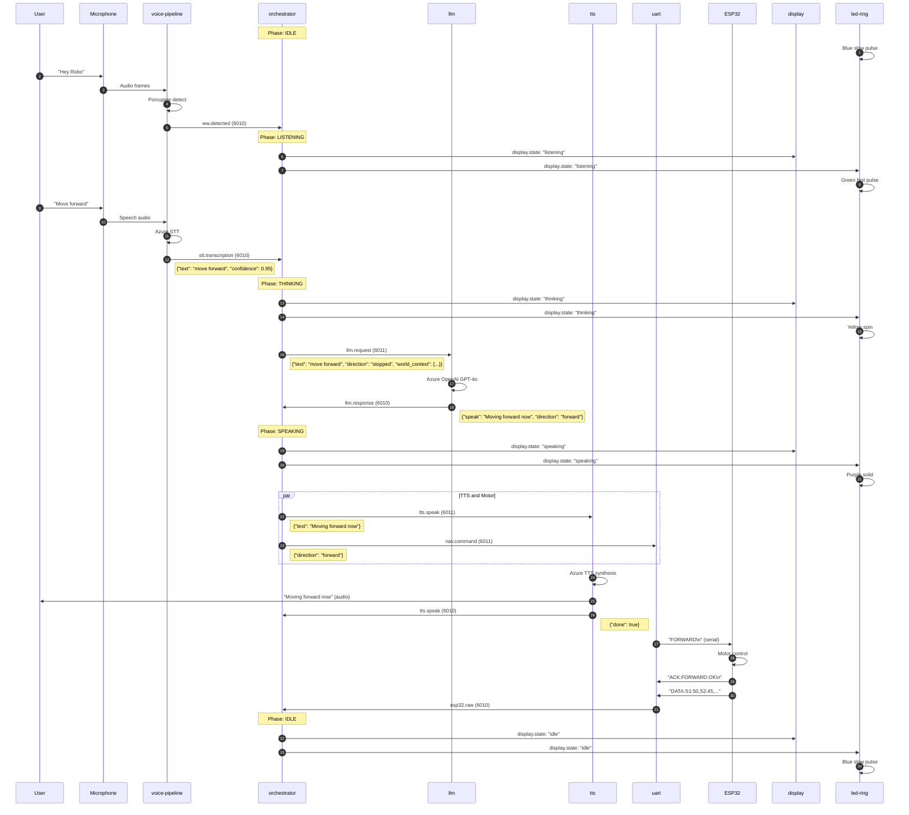
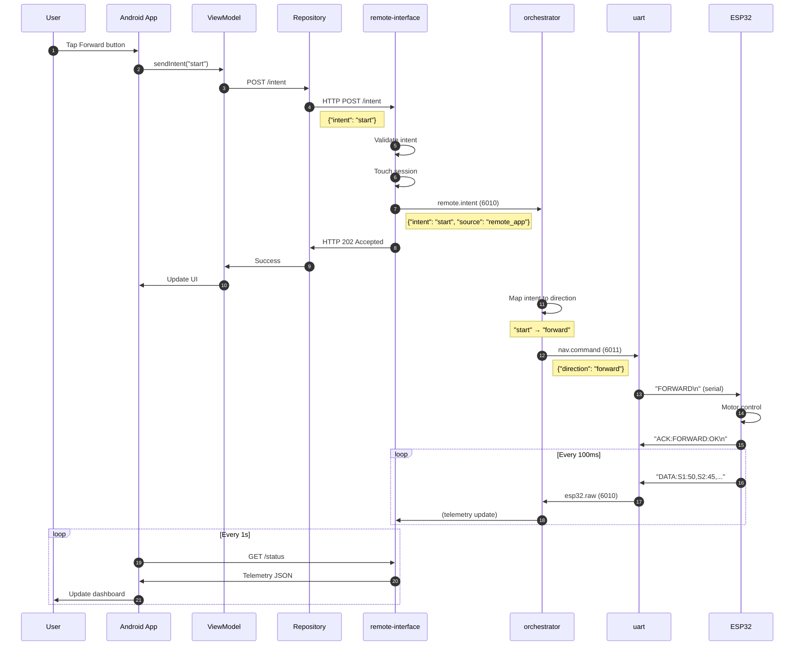
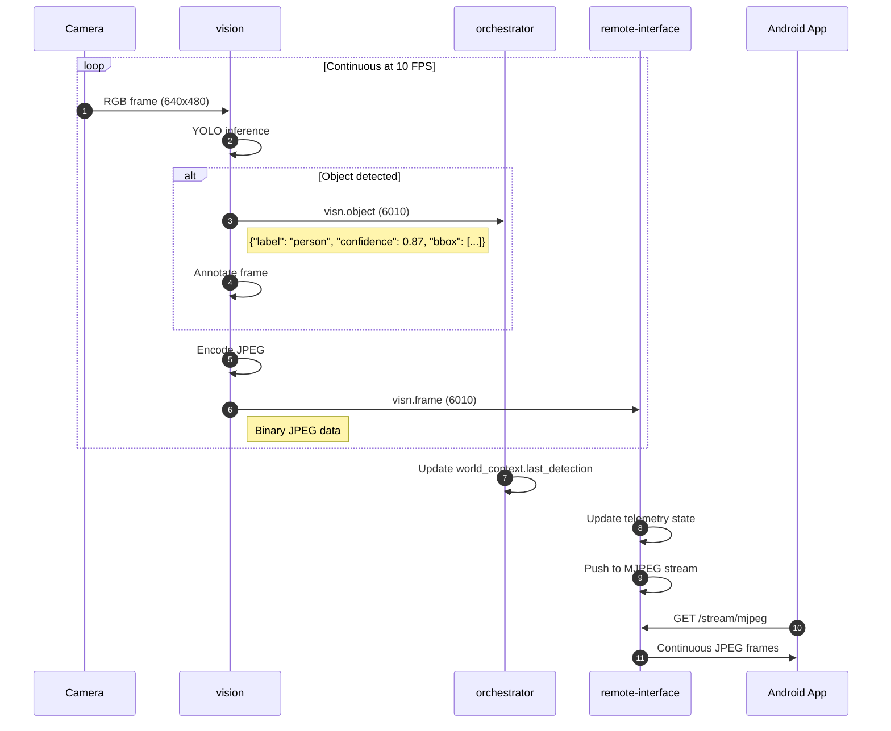
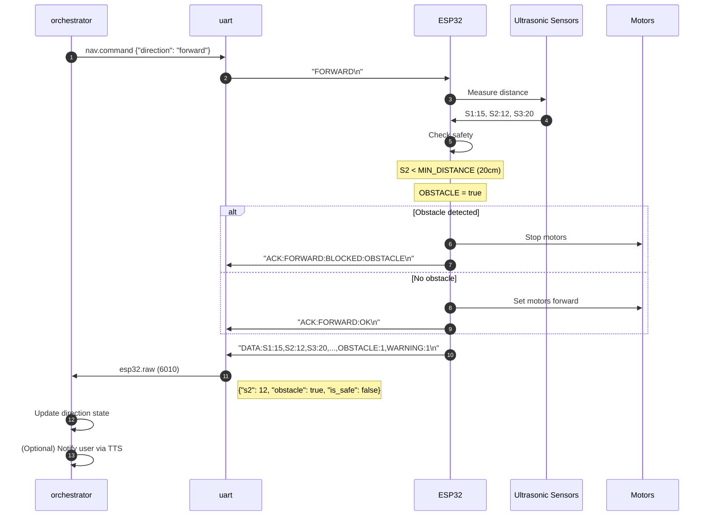
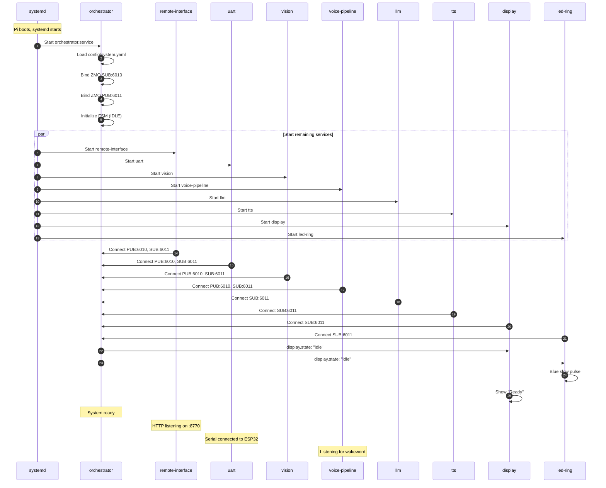
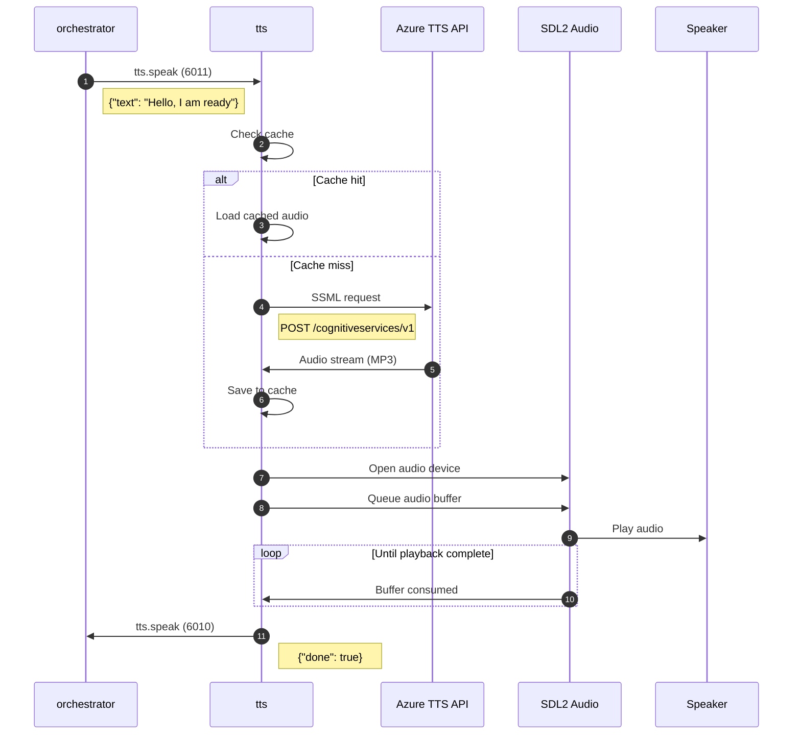
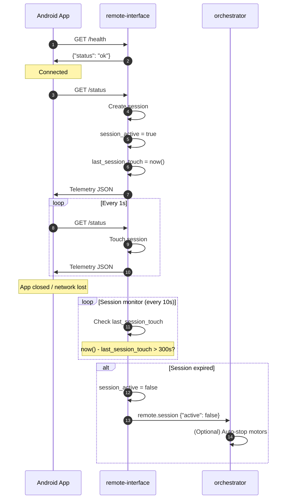
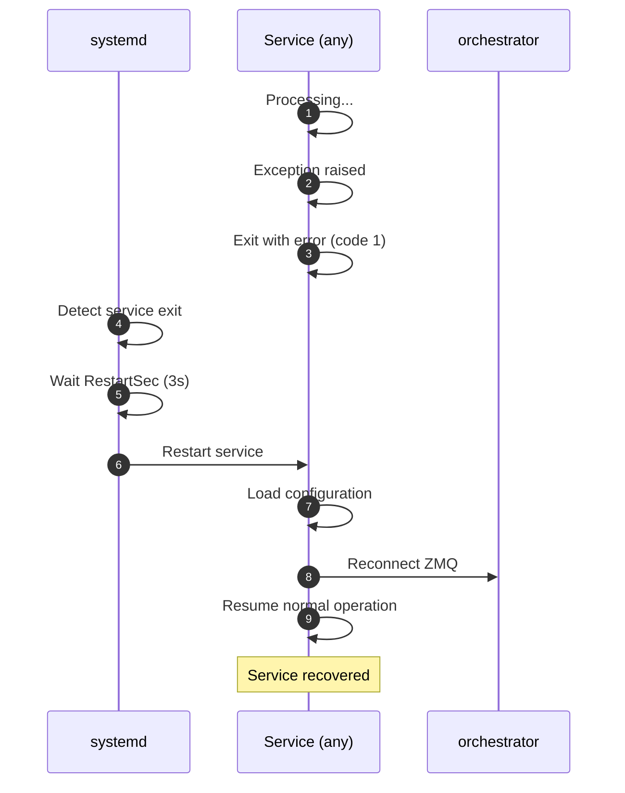
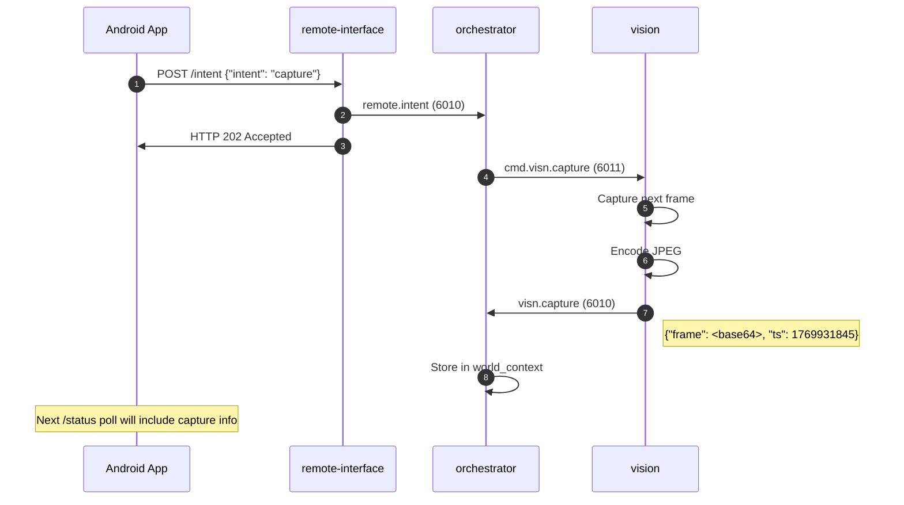
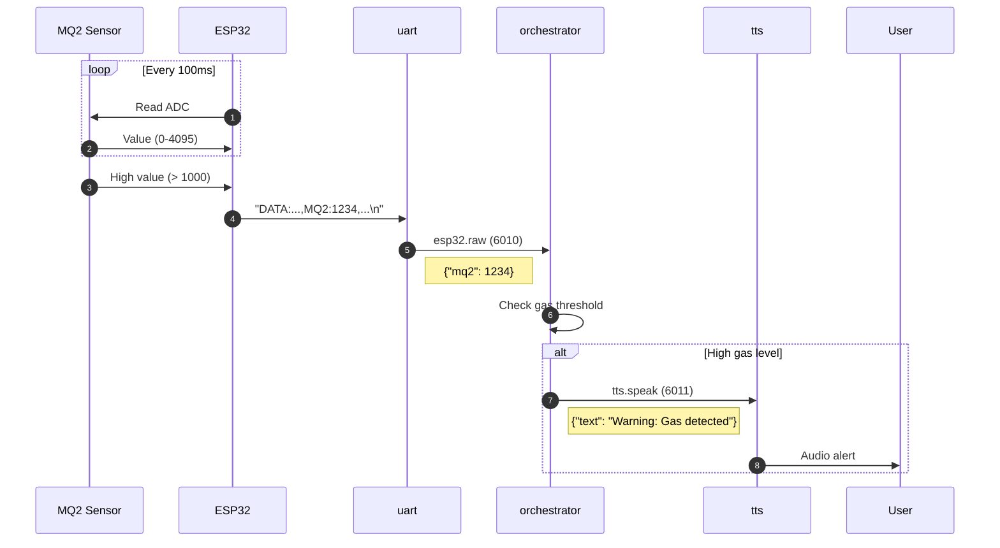

# Execution Flows

## Document Information

| Attribute | Value |
|-----------|-------|
| Document | 11_execution_flows.md |
| Version | 1.0 |
| Last Updated | 2026-02-01 |

---

## Overview

This document provides detailed sequence diagrams for the major execution flows in the smart_car system. Each flow is documented with Mermaid diagrams showing the complete data path from trigger to completion.

---

## 1. Voice Command Flow

### Description

User speaks a wake word, gives a voice command, and the robot responds with both speech and motion.

### Sequence Diagram



### Timing Estimates

| Step | Duration |
|------|----------|
| Wakeword detection | 100ms |
| STT recognition | 1-3s |
| LLM inference | 1-3s |
| TTS synthesis | 500ms-1s |
| Motor start | 50ms |
| **Total** | 3-8s |

---

## 2. Mobile App Control Flow

### Description

User taps a direction button in the Android app, which sends an intent to the Pi to control the robot.

### Sequence Diagram



### Intent to Direction Mapping

| Intent | Direction |
|--------|-----------|
| start | forward |
| stop | stopped |
| left | left |
| right | right |

---

## 3. Vision Detection Flow

### Description

Camera captures frames, vision service runs inference, and detections are published for other services.

### Sequence Diagram



### Vision Modes

| Mode | Behavior |
|------|----------|
| detection | Continuous inference + annotation |
| capture | Single frame capture on demand |
| off | Camera disabled |

---

## 4. Collision Avoidance Flow

### Description

ESP32 detects obstacle and blocks forward movement. Robot stops and reports status.

### Sequence Diagram



### Safety Thresholds

| Zone | Distance | Action |
|------|----------|--------|
| Safe | > 40 cm | Allow movement |
| Warning | 20-40 cm | Block forward (WARNING flag) |
| Obstacle | < 20 cm | Emergency stop (OBSTACLE flag) |

---

## 5. Service Startup Flow

### Description

System boot sequence from power-on to ready state.

### Sequence Diagram



### Boot Timeline

| Time | Event |
|------|-------|
| T+0s | Power on |
| T+20s | Linux boots |
| T+30s | Network ready |
| T+35s | orchestrator starts |
| T+40s | All services connected |
| T+45s | System ready |

---

## 6. TTS Playback Flow

### Description

Text-to-speech synthesis and audio playback.

### Sequence Diagram



---

## 7. Session Management Flow

### Description

Mobile app session lifecycle from connection to timeout.

### Sequence Diagram



---

## 8. Error Recovery Flow

### Description

System behavior when a component fails and recovers.

### Sequence Diagram



### Systemd Configuration

```ini
Restart=always
RestartSec=3
```

---

## 9. Frame Capture Flow

### Description

Single frame capture triggered from mobile app.

### Sequence Diagram



---

## 10. Gas Sensor Alert Flow

### Description

MQ2 gas sensor detects high levels and system responds.

### Sequence Diagram



---

## Summary Table

| Flow | Trigger | Primary Path | Duration |
|------|---------|--------------|----------|
| Voice Command | Wake word | VP→O→LLM→TTS→UART | 3-8s |
| Mobile Control | Button tap | App→RI→O→UART | 200ms |
| Vision Detection | Continuous | Camera→V→O→RI | 100ms/frame |
| Collision Avoidance | Obstacle | Sensors→ESP→UART→O | 50ms |
| Startup | Boot | systemd→all services | 45s |
| TTS Playback | Command | O→TTS→Azure→Speaker | 1-2s |
| Session | App connect | App→RI polling | Ongoing |
| Error Recovery | Service crash | systemd restart | 3s |
| Frame Capture | Intent | App→RI→O→V | 200ms |
| Gas Alert | Sensor | MQ2→ESP→UART→O→TTS | 500ms |

---

## References

| Document | Purpose |
|----------|---------|
| [04_ipc_and_data_flow.md](04_ipc_and_data_flow.md) | IPC details |
| [05_services_reference.md](05_services_reference.md) | Service specs |
| [diagrams/voice_to_action_pipeline.md](diagrams/voice_to_action_pipeline.md) | Visual diagram |
