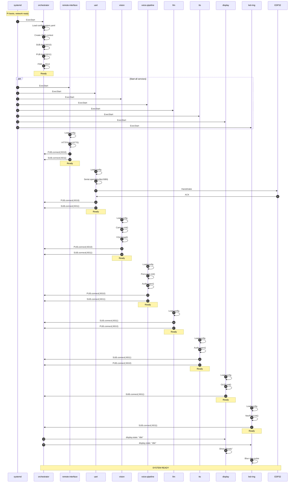

# Service Startup Sequence Diagram

## Document Information

| Attribute | Value |
|-----------|-------|
| Document | diagrams/service_startup_sequence.md |
| Version | 1.0 |
| Last Updated | 2026-02-01 |

---

## Overview

This diagram shows the complete startup sequence from Raspberry Pi boot to system ready state.

---

## Boot Timeline

```
Time    Event
─────   ─────────────────────────────────────────────────────────────────────────────────────

T+0s    ┌─────────────────────────────────────────────────────────────────────────────────┐
        │                              POWER ON                                            │
        └─────────────────────────────────────────────────────────────────────────────────┘

T+5s    ┌─────────────────────────────────────────────────────────────────────────────────┐
        │                            BOOTLOADER                                           │
        │                         (Raspberry Pi firmware)                                 │
        └─────────────────────────────────────────────────────────────────────────────────┘

T+10s   ┌─────────────────────────────────────────────────────────────────────────────────┐
        │                           LINUX KERNEL                                          │
        │                      (Raspberry Pi OS Bookworm)                                 │
        └─────────────────────────────────────────────────────────────────────────────────┘

T+25s   ┌─────────────────────────────────────────────────────────────────────────────────┐
        │                             systemd                                             │
        │                         (Init system)                                           │
        └─────────────────────────────────────────────────────────────────────────────────┘

T+30s   ┌─────────────────────────────────────────────────────────────────────────────────┐
        │                        network.target                                           │
        │                    (WiFi/Ethernet connected)                                    │
        └─────────────────────────────────────────────────────────────────────────────────┘

T+32s   ┌─────────────────────────────────────────────────────────────────────────────────┐
        │                       tailscaled.service                                        │
        │                      (VPN established)                                          │
        └─────────────────────────────────────────────────────────────────────────────────┘

T+35s   ┌─────────────────────────────────────────────────────────────────────────────────┐
        │                      orchestrator.service                                       │
        │                  (Binds ZMQ ports 6010, 6011)                                  │
        │                   (Initializes FSM to IDLE)                                     │
        └─────────────────────────────────────────────────────────────────────────────────┘

T+36s   ┌─────────────────────────────────────────────────────────────────────────────────┐
        │    ┌──────────────┐  ┌──────────────┐  ┌──────────────┐  ┌──────────────┐       │
        │    │ remote-      │  │    uart      │  │   vision     │  │    llm       │       │
        │    │ interface    │  │              │  │              │  │              │       │
        │    └──────────────┘  └──────────────┘  └──────────────┘  └──────────────┘       │
        │    ┌──────────────┐  ┌──────────────┐  ┌──────────────┐  ┌──────────────┐       │
        │    │    tts       │  │voice-pipeline│  │   display    │  │  led-ring    │       │
        │    │              │  │              │  │              │  │              │       │
        │    └──────────────┘  └──────────────┘  └──────────────┘  └──────────────┘       │
        │                     (All services start in parallel)                            │
        └─────────────────────────────────────────────────────────────────────────────────┘

T+40s   ┌─────────────────────────────────────────────────────────────────────────────────┐
        │              All services connected to ZMQ buses                                │
        │              HTTP server listening on :8770                                     │
        │              UART connected to ESP32                                            │
        │              Camera initialized                                                 │
        │              Audio devices opened                                               │
        └─────────────────────────────────────────────────────────────────────────────────┘

T+45s   ┌─────────────────────────────────────────────────────────────────────────────────┐
        │                          SYSTEM READY                                           │
        │                                                                                 │
        │                      LED Ring: Blue slow pulse                                  │
        │                      Display: "Ready"                                           │
        │                      Phase: IDLE                                                │
        │                      Listening for wakeword                                     │
        └─────────────────────────────────────────────────────────────────────────────────┘
```

---

## Service Dependency Graph

```
                                    network.target
                                         │
                                         │ After=
                                         ▼
                              ┌─────────────────────┐
                              │    orchestrator     │
                              │                     │
                              │  Binds 6010, 6011   │
                              └──────────┬──────────┘
                                         │
                     ┌───────────────────┼───────────────────┐
                     │                   │                   │
                     ▼                   ▼                   ▼
          ┌─────────────────┐  ┌─────────────────┐  ┌─────────────────┐
          │ remote-interface │  │      uart       │  │     vision      │
          │                 │  │                 │  │                 │
          │ After=orch...   │  │ After=network   │  │ After=network   │
          └─────────────────┘  └─────────────────┘  └─────────────────┘

          ┌─────────────────┐  ┌─────────────────┐  ┌─────────────────┐
          │       llm       │  │       tts       │  │  voice-pipeline │
          │                 │  │                 │  │                 │
          │ After=network   │  │ After=network   │  │ After=network   │
          └─────────────────┘  └─────────────────┘  └─────────────────┘

          ┌─────────────────┐  ┌─────────────────┐
          │     display     │  │    led-ring     │
          │                 │  │                 │
          │ After=network   │  │ After=network   │
          └─────────────────┘  └─────────────────┘
```

---

## Startup Sequence Diagram



---

## Service Initialization Details

### orchestrator

```
1. Parse command line args
2. Load config/system.yaml
3. Configure logging
4. Create ZMQ context
5. Bind SUB socket to :6010
6. Bind PUB socket to :6011
7. Initialize FSM (state = IDLE)
8. Initialize world context
9. Start main loop
```

### remote-interface

```
1. Load config
2. Create ZMQ sockets (connect to 6010, 6011)
3. Initialize TelemetryState
4. Create HTTP server
5. Register routes (/health, /status, /intent, /stream/mjpeg)
6. Start HTTP listener on :8770
7. Start ZMQ receiver thread
8. Start main loop
```

### uart

```
1. Load config
2. Open serial port (/dev/ttyUSB0, 115200)
3. Create ZMQ sockets
4. Send STATUS to ESP32
5. Wait for ACK
6. Start sensor data receiver thread
7. Start command handler loop
```

### vision

```
1. Load config
2. Initialize Picamera2
3. Configure camera (640x480, 10fps)
4. Load YOLO model (yolov8n.pt)
5. Create ZMQ sockets
6. Start camera
7. Start inference loop
```

### voice-pipeline

```
1. Load config
2. Initialize audio input (ALSA)
3. Load Porcupine wakeword model
4. Initialize Azure STT client
5. Create ZMQ sockets
6. Start audio capture thread
7. Start wakeword detection loop
```

---

## Failure Recovery

### Service Crash

```
┌─────────────────┐     crash      ┌─────────────────┐
│     Running     │ ─────────────► │     Stopped     │
└─────────────────┘                └────────┬────────┘
                                            │
                                     RestartSec=3
                                            │
                                            ▼
                                   ┌─────────────────┐
                                   │   Restarting    │
                                   └────────┬────────┘
                                            │
                                            ▼
                                   ┌─────────────────┐
                                   │     Running     │
                                   └─────────────────┘
```

### systemd Configuration

```ini
[Service]
Restart=always
RestartSec=3
```

---

## Health Check Points

| Time | Check | Expected |
|------|-------|----------|
| T+35s | orchestrator running | `systemctl is-active orchestrator` → active |
| T+40s | HTTP responding | `curl localhost:8770/health` → `{"status":"ok"}` |
| T+40s | ZMQ ports bound | `ss -tlnp \| grep 6010` → LISTEN |
| T+45s | All services active | All 9 services → active |

---

## References

| Document | Purpose |
|----------|---------|
| [09_deployment_and_operations.md](../09_deployment_and_operations.md) | Deployment guide |
| [05_services_reference.md](../05_services_reference.md) | Service details |
